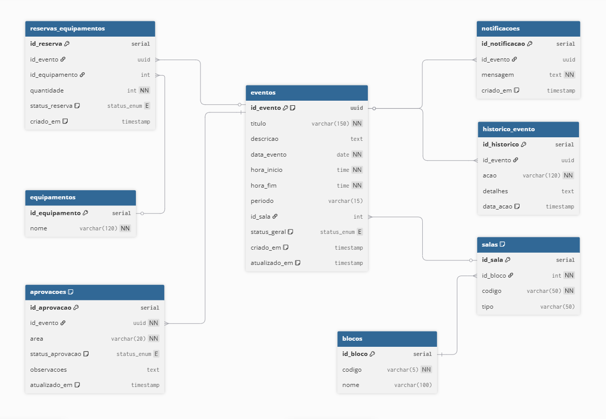

# Sistema de Agendamento de Eventos Universitários

Este sistema foi desenvolvido para **automatizar o processo de agendamento e aprovação de eventos universitários**, substituindo os antigos formulários e planilhas manuais utilizados por professores e coordenadores.
O projeto integra as áreas de **Cerimonial**, **Marketing** e **Audiovisual**, centralizando todas as solicitações, podendo ser aprovadas, reprovadas e canceladas, reserva de equipamentos em uma única aplicação **containerizada, com API REST e banco de dados relacional.**

------

## Arquitetura

<div align="center">
  
</div>

------

## Estrutura do Projeto

```bash
programacao_radical2025/
│
├── eventos_univag/                        # Pasta de configuração global do projeto Django
│   ├── _init_.py                          # Indica que este diretório é um pacote Python
│   ├── asgi.py                            # Configuração ASGI (para servidores assíncronos)
│   ├── settings.py                        # Arquivo central de configuração do projeto (apps, templates, static, banco, etc.)
│   ├── urls.py                            # Roteamento global do projeto (liga todas as rotas dos apps)
│   ├── wsgi.py                            # Configuração WSGI (para servidores web tradicionais)
│
├── core/                                  # App principal - tela inicial, painel e integração geral entre setores
│   ├── _init_.py
│   ├── admin.py                           # Registro de modelos no painel admin (não usado no mock)
│   ├── apps.py                            # Configuração do app Core (nome e inicialização)
│   ├── models.py                          # (Mockado) - pode futuramente armazenar usuários, solicitações, etc.
│   ├── tests.py                           # Testes automatizados (não utilizados ainda)
│   ├── urls.py                            # Rotas locais (ex: "/", "/painel/")
│   ├── views.py                           # Funções que controlam as telas iniciais e painel de solicitações
│   ├── migrations/                        # Diretório de migrações do banco (vazio enquanto estiver usando mock)
│   ├── templates/                         # Templates HTML do app Core
│   │   ├── core/
│   │   │   ├── home.html                  # Tela inicial (setores + calendário + solicitações)
│   │   │   └── painel.html                # Painel de solicitações pendentes do usuário
│
├── audiovisual/                           # App responsável pelo setor Audiovisual
│   ├── _init_.py
│   ├── admin.py                           # Configuração administrativa do app
│   ├── apps.py                            # Configuração do aplicativo no Django
│   ├── models.py                          # (Mockado) - representará futuras reservas de equipamentos
│   ├── tests.py
│   ├── urls.py                            # Rotas locais (ex: "/audiovisual/", "/audiovisual/nova/")
│   ├── views.py                           # Controle de exibição e formulários do setor
│   ├── migrations/
│   ├── templates/                         # HTMLs específicos do setor audiovisual
│   │   ├── audiovisual/
│   │   │   ├── painel.html                # Painel com solicitações e status
│   │   │   └── nova.html                  # Formulário de nova solicitação audiovisual
│
├── marketing/                             # App responsável pelo setor de Marketing
│   ├── _init_.py
│   ├── admin.py
│   ├── apps.py
│   ├── models.py                          # (Mockado) - futuramente guardará campanhas, briefings, etc.
│   ├── tests.py
│   ├── urls.py                            # Rotas locais ("/marketing/", "/marketing/nova/")
│   ├── views.py                           # Controle das telas do setor
│   ├── migrations/
│   ├── templates/
│   │   ├── marketing/
│   │   │   ├── painel.html                # Painel de solicitações de marketing
│   │   │   └── nova.html                  # Formulário para solicitar novos serviços
│
├── cerimonial/                            # App responsável pelo setor Cerimonial
│   ├── _init_.py
│   ├── admin.py
│   ├── apps.py
│   ├── models.py                          # (Mockado) - representará pedidos de eventos, formaturas etc.
│   ├── tests.py
│   ├── urls.py                            # Rotas locais ("/cerimonial/", "/cerimonial/nova/")
│   ├── views.py                           # Lógica e renderização das páginas
│   ├── migrations/
│   ├── templates/
│   │   ├── cerimonial/
│   │   │   ├── painel.html                # Painel de solicitações e status do setor cerimonial
│   │   │   └── nova.html                  # Formulário para nova solicitação cerimonial
│
└── static/                                # Arquivos estáticos (compartilhados entre todos os apps)
│   ├── css/
│   │   └── style.css                      # Arquivo de estilo global opcional
│   ├── js/
│   │   └── script.js                      # JavaScript global (funções interativas)
│   └── img/
│   │   └── univag_logo.png                # Logo institucional Univag
│
├── database/
│   └── schema.sql                         # Criação de tabelas e ENUM
│
├── docs/
│   └── Dicionario_de_Dados.csv            # Dicionário completo do banco
│
├── mmanage.py                             # Um CLI do DJANGO do Python, respnsável por rodar o projeto
├── docker-compose.yml                     # Orquestração dos containers
├── requirements.txt                       # Dependências Python
└── README.md
```

------

## Modelagem do Banco de Dados

Se trata de uma modelagem OLTP, de um banco de dados relacional.



> O sistema utiliza PostgreSQL com suporte a UUID, ENUM e chaves compostas.

------

## Tecnologias Utilizadas

- **Linguagem:**	Python 3.12.2
- **Web:** Django
- **Integração:**	FastAPI
- **Banco de Dados:**	PostgreSQL
- **Infraestrutura:**	Docker
- **Documentação API:**	Swagger UI (FastAPI Docs)
- **Versionamento:**	Git / GitHub

------

## Como Executar o Projeto

Pré-requisitos:
- [Docker](https://www.docker.com/)

### Passos

**1. Clone o repositório**
```bash
git clone https://github.com/gabrielpereira/eventos-universidade.git
cd programacao_radical2025
```

**2. Inicie os containers**
```bash
docker compose up --build
```

**3. Acesse os serviços**
- Frontend: ```	http://localhost:8000 ```
- Documentação API: ``` http://localhost:8000/docs ```
- Banco de Dados``` localhost:5432 ```
```bash
Usuário: admin
Senha: admin
Banco: radical
```

------

## Principais Funcionalidades

- ✅ Cadastro e gerenciamento de eventos acadêmicos
- ✅ Aprovação por área (Cerimonial, Marketing e Audiovisual)
- ✅ Reserva de equipamentos (com ou sem vínculo a eventos)
- ✅ Histórico completo de ações e notificações automáticas
- ✅ Envio automático de notificações por email para atualizar o estado da solicitação
- ✅ Estrutura containerizada, escalável e modular
- ✅ API REST para facilitar a integração a sistemas

------

## Documentação

* [Dicionário de Dados](docs/Dicionario_De_Dados.xlsx)
* [Modelagem Dimensional](docs/ModelagemOLTP.png)

------

## Conceitos Técnicos Envolvidos
- Containerização com Docker: isola a API e o banco de dados em ambientes virtuais.
-	ORM com SQLAlchemy: abstrai operações SQL e simplifica a manipulação de dados.
-	UUIDs: garantem unicidade global nos registros.
-	ENUMs: padronizam status de eventos e aprovações (pendente, aprovado, reprovado e cancelado).
-	FastAPI + Swagger: oferece endpoints rápidos, assíncronos e documentados automaticamente.

------

## Adicionais:

* [Protótipo Figma](https://www.figma.com/design/bUChrW8MQwAQxpellHoOQ8/Untitled?node-id=0-1&p=f&t=9M6JBuPbZMARUh9G-0)
* [Documentação](https://docs.google.com/document/d/1s7TmoNGMm8NTHw2vXC8pJlrGP8pOEPzbyD8Foe-UZ9E/edit?usp=sharing)


## 🧑‍💻 Autores

José Gabriel | Gabriel Barbieri | Andre Santiago | Arthur Floriano | João Faccio | Lucas Marques | Rodrigo
